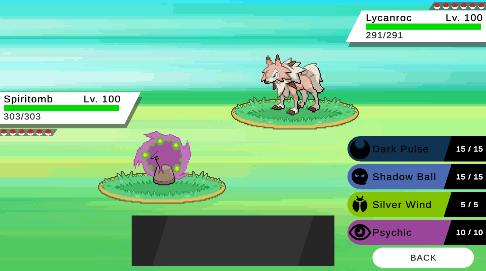
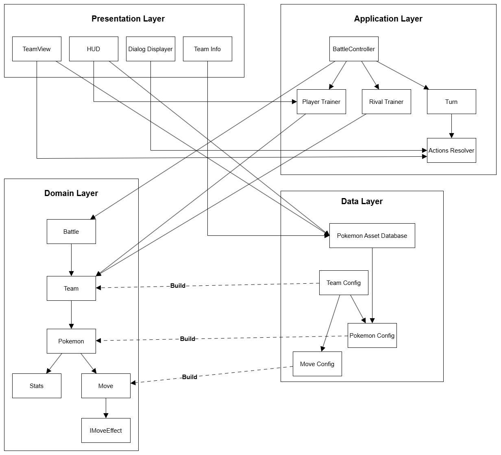
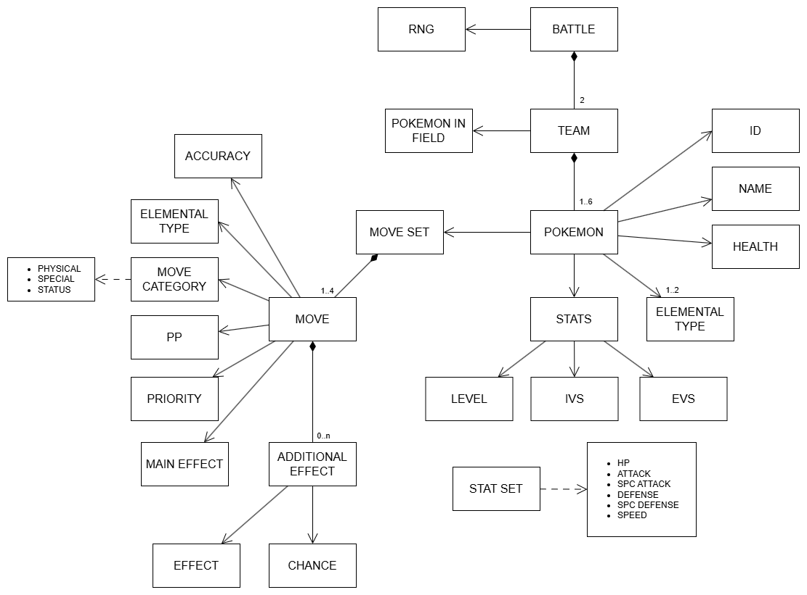
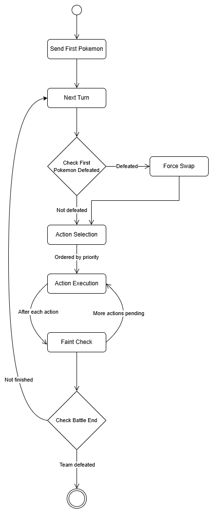
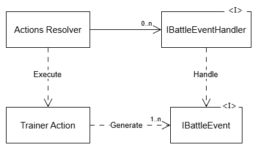
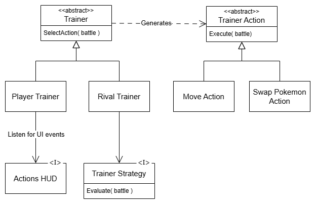
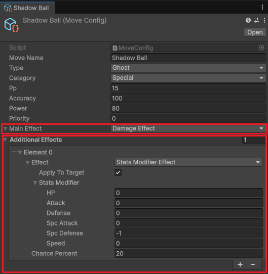
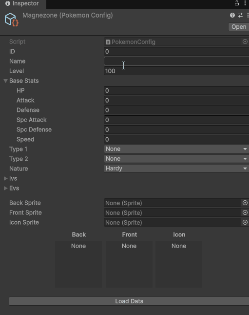

# POKEMON BATTLE CLONE

## TL;DR
This project recreates the battle system from the Pokémon games, focusing on core mechanics rather than visual polish.

### Implemented features
- Turn-based flow and battle state management
- Core actions such as switching Pokémon and executing moves
- Move effects including stats boosts/reductions, recoil, and healing
- - Moves can miss based on accuracy and may apply additional effects with a given probability

### Not included (yet)
- Status conditions (burn, paralysis, etc)
- Some moves effects (e.g. status infliction, protection moves, etc)
- Abilities
- Weather
- Critical hits

These features are planned for future updates.

### Goal
The main goal of this project is not visual fidelity, but to demonstrate a solid software architecture and a domain-driven design approach.

You can play the game directly in your browser on [`itch.io`](https://diegorg64.itch.io/pokemon-battle-clone)

## Table of Contents
- [Architecture Overview](#architecture-overview)
- [Domain Design](#domain-design)
- [Battle Flow](#battle-flow)
  - [Battle Events](#battle-events)
- [Trainers & Decision Making](#trainers--decision-making)
- [Moves & Effects System](#moves--effects-system)
  - [Modular Effects](#modular-effects)
  - [Execution Pipeline](#execution-pipeline)
- [Deterministic Battles (RNG)](#deterministic-battles-rng)
- [Data Integration (PokeAPI)](#data-integration-pokeapi)

## Architecture Overview
This project follows a domain-driven design approach, with a clear separation between core logic and Unity-specif code.

The architecture is divided into several layers:

- **Domain**: contains the core battle logic and rules (Battle, Pokemon, Moves, Effects)
- **Application**: orchestrates the battle flow and coordinates actions.
- **Infrastructure**: handles external systems such as data loading and integrations.
- **Presentation**: manages UI and user interaction (Unity-specific code).

The system is designed to be modular, testable and easily extensible.

## Domain Design

The core of the project is built following a domain-driven design approach.

The domain layer models the key concepts of a Pokémon battle, such as:
- Battle
- Teams
- Pokemon
- Moves and Effects

These elements encapsulate the game rules and behavior, and are completely independent from Unity-specific code.

Below is a high-level representation of the domain model:

## Battle Flow

A battle is executed as a sequence of turns, each divided into three main phases:
- Turn start
- Action selection
- Action execution

The flow is implemented using `async/await`, allowing the sequence of actions to be expressed in a clear and maintainable way.

### Battle Events

Each action performed during a turn can generate one or more `Battle Events`, which are processed sequentially.

These events describe what happens during the battle (e.g. damage dealt, stat changes, etc) and are used to drive the visual representation and the battle log messages.

For example, executing a move like `Shadow Ball` might generate the following events:

- **If the move misses:**
  - `Failed Move Event` *(The action execution ends here)*

- **If the move hits:**
  - `Execute Move Event`

  - **If the target is immune:**
    - `Immune Move Event`
    
  - **If the target is not immune:**
    - `Damage Event`
    
    - **If the additional effect is triggered (20% chance to lower special defense):**
      - `Stats Modifier Event`
  
  - **After the action is resolved:**
    - If the target pokemon faints:
      - `Fainted Event` *(this event is not generated directly by the move itself, but as a result of a post-action state check)*

## Trainers & Decision Making

Trainers are responsible for selecting actions during each turn.

- `PlayerTrainer` represents the human player and interacts with the UI to select actions.
- `RivalTrainer` uses a strategy-based system to determine which action to perform.

The AI behavior is defined through the `ITrainerStrategy` interface, allowing different decision-making strategies to be implemented and swapped easily.

Both trainers ultimately produce a `TrainerAction`, which encapsulates the execution logic (e.g. performing a move or switching pokemon). This separation allows decoupling decision-making from action execution, making the system more modular and extensible.

This design also makes it easy to extend the system with new types of trainers, such as more advanced AI or network-based players.

## Moves & Effects System

### Modular Effects

Moves are composed of reusable effects (damage, stat changes, healing, etc). This allows creating new moves without modifying code, simply by configuring their effects.

Each move defines:
- A main effect (e.g. damage)
- Optional additional effects with an associated probability

This design allows combining simple effects to create complex move behaviors without increasing system complexity.

### Execution Pipeline

The execution of a move is handled through a structured pipeline:

1. A `MoveAction` encapsulates the execution of a move
2. The move is resolved (accuracy check, immunity, effects, etc)
3. The execution generates `Battle Events` describing what happens
4. These events are processed to drive the visual representation and battle log

## Deterministic Battles (RNG)

Each battle uses its own RNG instance through the `IRandom` interface. By injecting the RNG into the `Battle` class, all random behavior (e.g. accuracy checks, secondary effects, etc) is fully controlled by this dependency.

By providing a fixed seed, battles can be reproduced deterministically, which is especially useful for debugging and testing (e.g. deterministic or mocked random generators).
This ensures that the core battle logic remains deterministic and independent from the underlying random implementation.

## Data Integration (PokeAPI)

Pokemon and move data are loaded using PokeAPI through a .NET integration. This allows new content to be added quickly without manual data entry, reducing errors and improving iteration speed.

A custom Unity editor tool is used to fetch and populate pokemon data directly into ScriptableObjects, including:
- Base stats
- Types
- Sprites (automatically downloaded and imported into the project)

This approach turns external data into in-engine assets, bridging the gap between online resources and the game's data model. It also streamlines the workflow when adding new pokemon, as most of the data can be generated automatically from a single source.

## License
This project is released under the MIT License by Diego Ruiz Gil (2026)
